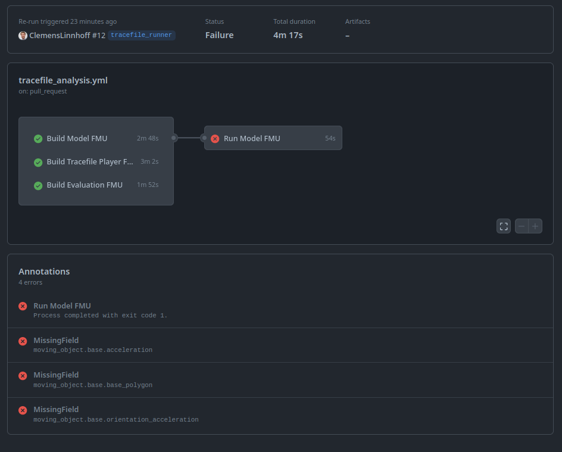

# sl-5-2-osi-field-checker

This FMU checks if fields are missing in a received SensorData.
It is meant to be used in a co-simulation connected to the output of the model under test.
It will output missing osi fields in the format of GitHub annotations, so that it can be used directly in a GitHub CI pipeline.
The image below shows an example of a failed pipeline due to missing OSI fields in the SensorData.



## Parameterization

As parameters, the OSI Field Checker FMU needs the individual OSI fields to check.
The required fields are defined in a .txt file.
An example file can be found in example_check_file/.
The path to this txt file has to be passed as fmi parameter string *check_file*.

Currently, the FMU is able to check for the following fields based on the osi_check.txt file:

- moving_object
- moving_object.base
- moving_object.base.position
- moving_object.base.orientation
- moving_object.base.velocity
- moving_object.base.acceleration
- moving_object.base.orientation_rate
- moving_object.base.orientation_acceleration
- moving_object.base.base_polygon

## Interface

The FMU expects an OSI3::SensorData message as input.

## Build Instructions

Protobuf needs to be installed on your systems as a dependency.

### Build Model in Ubuntu 18.04 / 20.04 / 22.04

1. Clone this repository with submodules:

    ```bash
    git clone https://github.com/openMSL/sl-5-2-osi-field-checker.git --recurse-submodules
    ```

2. Build the model by executing in the extracted project root directory:

    ```bash
    mkdir cmake-build
    cd cmake-build
    # If FMU_INSTALL_DIR is not set, CMAKE_BINARY_DIR is used
    cmake -DCMAKE_BUILD_TYPE=Release -DFMU_INSTALL_DIR:PATH=/tmp ..
    cmake --build .
    ```

3. Take FMU from `FMU_INSTALL_DIR`

The OSI Field Checker FMU can now be used in a co-simulation connected to the output of the model under test.
